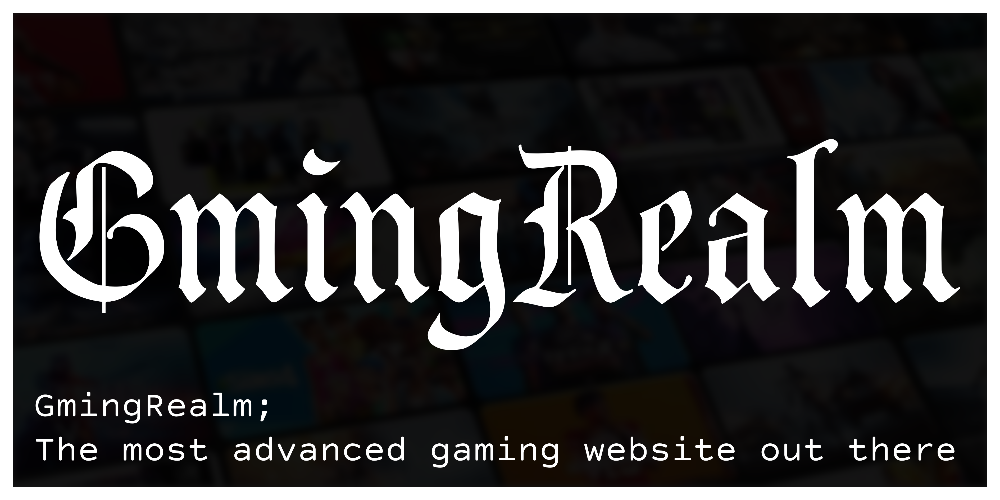

# GmingRealm | Reborn

  

    GmingRealm; The ultimate gaming website with 500+ games, as well as exploits for pretty much everything
     
    <a href="https://superredeyeball.netlify.app/">view demo</a>
    ·
    <a href="https://docs.google.com/forms/d/e/1FAIpQLSdU1CELhxTF7WqrW2ujKs9DHI1gANNJQqzN7Ojz6i8sIe-X6A/viewform?usp=sf_link">report issues / request feature</a>
     
     
    
    
    
  

    
### Welcome to Gmingrealm, the best gaming site you can find!

This project is open source and has a license specifically made to allow you to make your own copy of this. You can fork this and modify it and redistribute it all you work for all I care. I do ask that you credit me because I have dedicated quite a lot of time to this project and also credits to a456pur for making Seraph which this is inspired and built on.

## My backstory 

I used to have this gaming site hosted on replit, but it ran on replit which now sucks. Replit also got blocked in my school. The site even got resource limited so I took initiative after a while and restarted the best gaming site ever.

## Features

This site has a few features to make your life easier:
- Tab Hider (Opens tab in about:blank. Not visible to <em>some</em> extensions such as GoGuardian)
- Homepage can be disguised as pretty much anything you want such as demos, google, new tab, you name it!
- Built in script executor with keybinds to open for when you want to cheat in a game but the developer tools are disabled!
- Themes
- Panic mode to quickly replace current tab with a new one that someone would be proud of you being on such as your schoolwork
- Offline mode which can tell the browser to remember all of a certain games resources so it can be loaded without an internet connection!
- and more!

## Requests / Ideas / Bugs

To make a game request or review the site, please tell me in my [feedback form](https://docs.google.com/forms/d/e/1FAIpQLSdU1CELhxTF7WqrW2ujKs9DHI1gANNJQqzN7Ojz6i8sIe-X6A/viewform?usp=sf_link).

By the way, GmingRealm is currently and always has been worked on only by **me** (one person) so updates will start to slow down as I will be more busy with schoolwork. Wish me luck and I will (try to) always be working on this website whenever possible.
&nbsp;<h4><em>There are limitations to the games we can add.</em></h4>
- Only browser games. Please don't ask for Fortnite or Roblox. (They can't be <em>directly</em> added, but I still add sites that contain games like those, check utilities page)
- No online multiplayer games. Since the multiplayer servers for games can and will be blocked for most people, we cannot do online multiplayer. (A
gain, I still add sites that contain games like those, check utilities page)

## Pull requests

Pull requests are highly encouraged as they take work off our hands and allow people to contribute to this site.

<h4>&nbsp;&nbsp;&nbsp;&nbsp;&nbsp;<em>but wait, whats a pull request?!<em></h4>

> A pull request means you provide the solution to the problem you are telling us about. For example, a simple pull request could be that on line 133, a word is misspelled, so edit the code yourself to fix the misspelled word, and send in that pull request. It provides us with all added, modified, and removed lines of code. <em>Dont be adding in some sneaky viruses or something.</em> **Everything** is reviewed before commiting and pushing.
To do it, just fork the main repository on github, make the changes you think we should add to the website, and hit "create a pull request".

## Stats
  

 |  |  | 

  |  | 

  

## Credits

The owner of this repository is SuperBlueEyeball, who has made pretty much everything.

### Other contributors

* a456pur
> Main contribution (Games, Apps, UI, Inspiration and more)
---
* 3kh0
> Games
  ---
* Lucide Icons
> Awesome Icons (obviously)

---

- **game assets used**
>- 3kh0: [gitlab repository](https://gitlab.com/3kh0/3kh0-assets)
>- selenite: [gitlab repository](https://gitlab.com/skysthelimit.dev/selenite) · [codeberg repository](https://codeberg.org/skysthelimitt/selenite)
>- ShadowGmes: [github repository](https://github.com/Fusion-games4/shadowgfiles/tree/main/gfiles)
>- classroom6x: [gitlab repository](https://gitlab.com/classroom6x)

## DISCLAIMER

<h4>I am not responsible if you get in trouble at all for anything that has to do with this project. Also, this is NOT a copy of a456pur's game website, better yet just used as a template for my redo of my site. Huge credits to a456pur.</h4>
